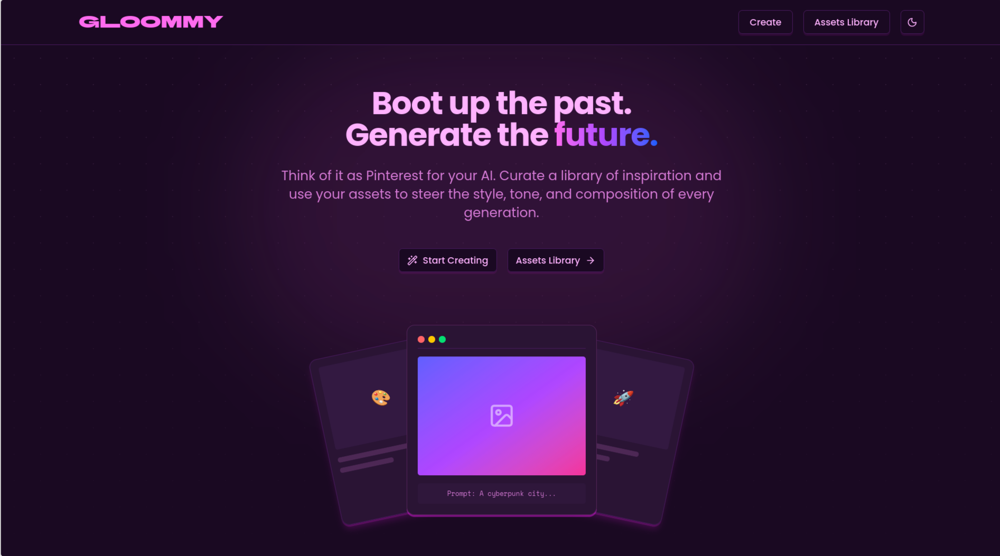
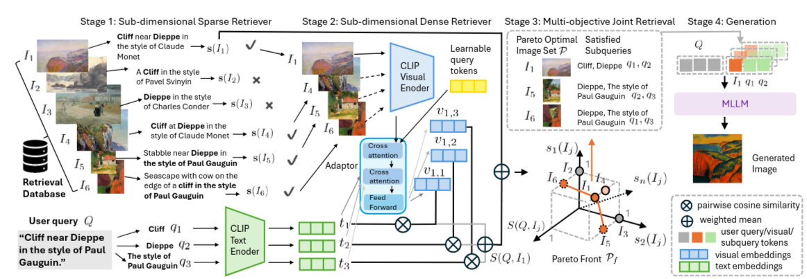
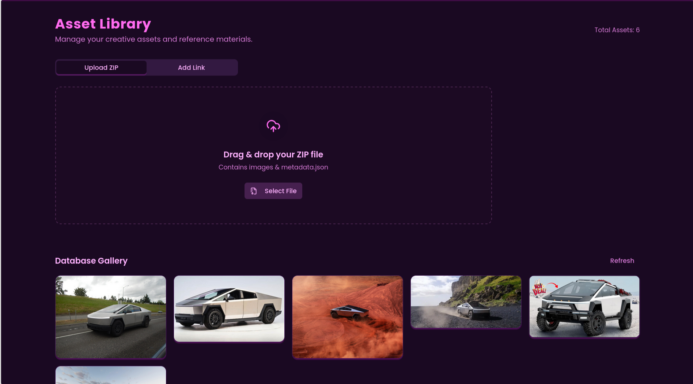
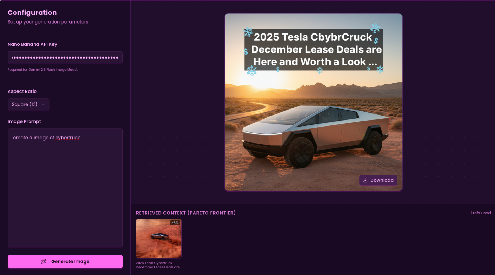

# Gloomy: Cross-Modal RAG Image Generator



**Gloomy** is a full-stack implementation of the **Cross-modal RAG** framework (arXiv:2505.21956). It bridges the gap between retrieval and generation by decomposing complex user prompts into sub-dimensional components and using **Pareto-Optimal retrieval** to ground generative AI models (Google Gemini 2.5) in specific visual contexts.

## 📄 Paper Implementation



This project implements the methodology described in **"Cross-modal RAG: Sub-dimensional Text-to-Image Retrieval-Augmented Generation"** (May 2025).

Unlike traditional RAG systems that retrieve globally relevant images, Gloomy addresses scenarios where no single image captures the entire query. It breaks down prompts and images into sub-dimensions (e.g., style, object, composition) to retrieve a complementary set of assets that collectively satisfy the user's intent.

## 🏗️ System Architecture

The system utilizes a dual-path retrieval mechanism (Sparse & Dense) culminating in a Pareto Frontier selection process before feeding context to the Gemini generator.

## 🚀 Key Features

### 1. Sub-Dimensional Retrieval Engine

Following the Cross-modal RAG protocol, Gloomy employs a hybrid search strategy to identify visual assets that maximize coverage of the decomposed query:

* **Sub-Dimensional Decomposition:** Uses **Spacy** to break down complex prompts into granular sub-queries (lemmas/keywords).
* **Sparse & Dense Hybrid:** Combines keyword matching with semantic alignment using a custom-trained `VisionAdapter` on top of CLIP (`openai/clip-vit-base-patch32`).
* **Pareto Frontier Selection:** Instead of a simple top-k, it selects a **Pareto-optimal set** of images. This optimizes the trade-off between lexical accuracy (sparse) and visual-semantic similarity (dense), ensuring the retrieved context covers all distinct aspects of the prompt.

### 2. Asset Library & Ingestion


Easily manage your visual database. Supports bulk ingestion via ZIP files or single-shot import via URL with automatic metadata processing to facilitate sub-dimensional indexing.

### 3. Context-Aware Generation

Generates new images using **Google Gemini 2.5 Flash**, explicitly grounded by the style and composition of retrieved assets. The UI provides transparency by showing exactly which images were used as context (the Pareto Frontier) and which sub-query aspect they fulfill.

---

## 🛠️ Tech Stack

### Backend

* **Framework:** FastAPI
* **ML Core:** PyTorch, Hugging Face Transformers (CLIP)
* **Generative AI:** Google GenAI SDK (Gemini 2.5 Flash Image)
* **Vector DB:** Custom in-memory vector store with persistence (`pickle`)
* **NLP:** SpaCy (for query decomposition)

### Frontend

* **Framework:** React (Vite)
* **Language:** TypeScript
* **Styling:** Tailwind CSS
* **Components:** Shadcn UI, Lucide React
* **Layout:** React Masonry CSS

---

## ⚡ Installation & Setup

### Prerequisites

* Python 3.10+ with CUDA support (recommended)
* Node.js & npm
* Google Gemini API Key

### 1. Backend Setup

```bash
cd backend

# Create virtual environment
python -m venv venv
source venv/bin/activate  # or venv\Scripts\activate on Windows

# Install dependencies
pip install fastapi uvicorn torch transformers google-genai spacy requests python-multipart pillow numpy
python -m spacy download en_core_web_sm

# Start the server
uvicorn main:app --reload

```

## 📚 Reference

If you use this implementation in your research, please cite the original paper:

```bibtex
@article{crossmodalrag2025,
  title={Cross-modal RAG: Sub-dimensional Text-to-Image Retrieval-Augmented Generation},
  journal={arXiv preprint arXiv:2505.21956},
  year={2025},
  url={https://arxiv.org/abs/2505.21956}
}

```